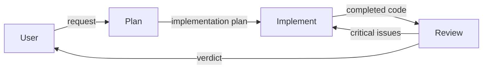

# Custom Agents Demo — Agent Pipeline

This project demonstrates **custom agent creation**, **tool restrictions**, and **handoff workflows** in VS Code Copilot using a Node.js task manager API.

## Project Structure

```
custom-agents-demo/
├── .github/
│   └── agents/
│       ├── plan.agent.md        # Read-only planning agent
│       ├── implement.agent.md   # Full-access implementation agent
│       ├── review.agent.md      # Read-only review agent
│       └── pipeline.agent.md    # Orchestrator agent
├── src/
│   ├── index.js                 # Entry point
│   ├── app.js                   # HTTP server & routing
│   ├── app.test.js              # Tests
│   ├── controllers/
│   │   └── taskController.js    # Request handling logic
│   ├── models/
│   │   └── taskStore.js         # In-memory data store
│   └── utils/
│       ├── http.js              # HTTP helpers
│       └── validation.js        # Input validation
└── README.md
```

## The Agent Pipeline



### 1. Plan Agent (`@workspace /plan`)

| Property | Value |
|----------|-------|
| **Tools** | `read`, `search` |
| **Access** | Read-only |
| **Purpose** | Analyze codebase and produce implementation plans |
| **Handoff** | → Implement |

The Plan agent can only read files and search the codebase. It cannot modify anything. It produces a structured plan document that the Implement agent consumes.

### 2. Implement Agent (`@workspace /implement`)

| Property | Value |
|----------|-------|
| **Tools** | `read`, `edit`, `search`, `execute`, `todo` |
| **Access** | Full (read + write + terminal) |
| **Purpose** | Execute the plan by writing code and running commands |
| **Handoff** | → Review |

The Implement agent has full access to edit files, run terminal commands (install packages, run tests), and track progress with todo lists. It follows the plan from the Plan agent.

### 3. Review Agent (`@workspace /review`)

| Property | Value |
|----------|-------|
| **Tools** | `read`, `search` |
| **Access** | Read-only |
| **Purpose** | Review for bugs, code quality, and security issues |
| **Handoff** | → (back to Implement if critical issues found) |

The Review agent can only read code and check diagnostics. It produces a structured review report with severity ratings.

### 4. Pipeline Orchestrator (`@workspace /pipeline`)

| Property | Value |
|----------|-------|
| **Tools** | `read`, `search`, `agent` |
| **Access** | Can invoke subagents only |
| **Purpose** | Coordinate the full Plan → Implement → Review flow |

## Key Concepts Demonstrated

### Tool Restrictions

Each agent has a **minimal set of tools** appropriate for its role:

```yaml
# Plan — read-only analysis
tools: [read, search]

# Implement — full access
tools: [read, edit, search, execute, todo]

# Review — read-only + diagnostics
tools: [read, search]
```

This enforces the **principle of least privilege** — agents can only do what their role requires.

### Handoff Workflows

Agents declare `handoffs` in their frontmatter to define transitions:

```yaml
# plan.agent.md
handoffs: ["implement"]

# implement.agent.md
handoffs: ["review"]
```

This creates a directed pipeline: **Plan → Implement → Review**.

### Agent Isolation

Each agent has:
- **Single responsibility** — one focused role
- **Clear boundaries** — explicit "DO NOT" constraints
- **Structured output** — predictable format for downstream agents

## How to Use

### Run the full pipeline:
```
@pipeline Add pagination support to the GET /tasks endpoint
```

### Use agents individually:
```
@plan Analyze what changes are needed to add user authentication
@implement Execute: [paste the plan here]
@review Review the latest changes for security issues
```

## Running the App

```bash
# Start the server
npm start

# Run tests
npm test

# Example API calls
curl http://localhost:3000/health
curl -X POST http://localhost:3000/tasks -H "Content-Type: application/json" -d '{"title":"My task","priority":"high"}'
curl http://localhost:3000/tasks
```
